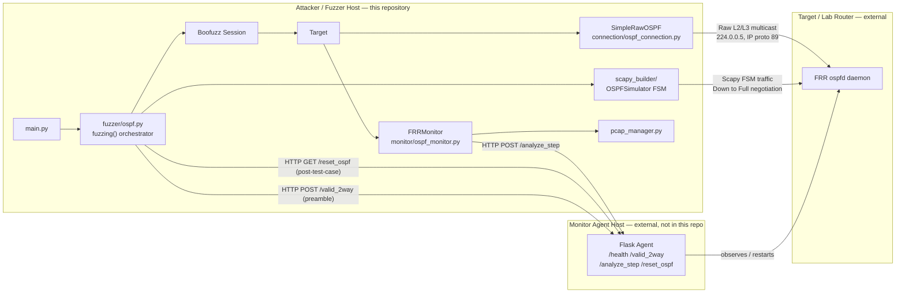
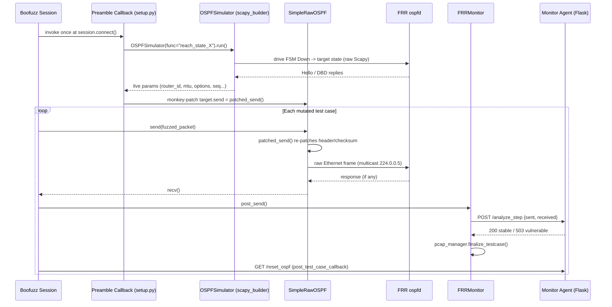

# OSPF State-Machine Fuzzer (Boofuzz + Scapy)

**Status:** Internal Research Tool — RFC 2328 (OSPFv2) protocol fuzzing platform targeting FRRouting (FRR)
**Maintainer role:** Senior Boofuzz Engineer
**Estimated onboarding time:** < 30 minutes

---

## Table of Contents

1. [Project Overview](#1-project-overview)
2. [Prerequisites & Dependencies](#2-prerequisites--dependencies)
3. [Quick Start Guide](#3-quick-start-guide)
4. [Project Architecture](#4-project-architecture)
5. [Configuration Management](#5-configuration-management)
6. [Execution](#6-execution)
7. [Troubleshooting](#7-troubleshooting)
8. [Security Considerations](#8-security-considerations)
9. [Known Issues & Contribution Guidelines](#9-known-issues--contribution-guidelines)

---

## 1. Project Overview

This repository implements a **stateful OSPFv2 protocol fuzzer** built on [Boofuzz](https://github.com/jtpereyda/boofuzz), targeting **FRRouting's `ospfd`** daemon. Unlike a stateless fuzzer, this platform first drives a live target router through the RFC 2328 neighbor adjacency FSM (`Down → Init → 2-Way → ExStart → Exchange → Loading → Full`) using a companion Scapy-based simulator, then injects Boofuzz-mutated packets **at a specific FSM state** while patching all protocol-invariant fields (checksums, sequence numbers, router/area IDs) at send time. This allows fuzzing of deep parser logic (LSA headers, DBD negotiation, LSR/LSU payloads) that is normally unreachable without full session validity.

**Functional scope:**

| Capability | Description |
|---|---|
| State-targeted fuzzing | Fuzz any one of 6 OSPF FSM states/packet types independently (`main.py` selects the state) |
| Live parameter injection | A Scapy FSM simulator (`scapy_builder/`) negotiates real session parameters with the target before/during fuzzing, which are patched into every mutated packet |
| Raw L2/L3 transport | Custom `ITargetConnection` (`SimpleRawOSPF`) sends/receives raw Ethernet frames over multicast (`224.0.0.5`, IP proto 89) — no kernel OSPF stack required on the attacker host |
| Crash & protocol-violation detection | A `BaseMonitor` (`FRRMonitor`) queries an external **Monitor Agent** (Flask service on the target/lab host) after every test case to classify process crashes vs. RFC-compliance violations |
| Forensic capture | Per-test-case PCAP capture (`pcap_manager.py`), retained only when a bug or crash is flagged |

**Out of scope for this repository:** the Monitor Agent (Flask service exposing `/health`, `/analyze_step`, `/reset_ospf`, `/restart_container`) that runs **on the target lab host** is a separate deployable and is *not* included in this codebase. It is a required external dependency — see [Section 2](#2-prerequisites--dependencies) and [Section 4](#4-project-architecture).

---

## 2. Prerequisites & Dependencies

### 2.1 Operating System

- **Linux only.** The transport layer (`fuzzer/connection/ospf_connection.py`) uses `AF_PACKET` raw sockets, `fcntl` `SIOCGIFADDR`/`SIOCGIFHWADDR` ioctls, and `PACKET_ADD_MEMBERSHIP` promiscuous-mode socket options — none of which exist on Windows or macOS.
- Verified against **Ubuntu** (any release with kernel ≥ 4.x is sufficient for raw socket + promiscuous support).

### 2.2 Python Runtime

- **Python 3.8** (compiled artifacts in the repo — `__pycache__/*.cpython-38.pyc` — confirm this is the validated interpreter version). Python 3.9–3.11 are likely compatible but have not been validated against this codebase; pin to 3.8 for guaranteed parity.
- **Root / `sudo` privileges are mandatory at runtime** — raw socket creation and promiscuous-mode configuration both require `CAP_NET_RAW` / `CAP_NET_ADMIN`, which in practice means running as root.

### 2.3 Python Package Dependencies

Install from the pinned lockfile:

```bash
pip install -r requirements.txt
```

Key packages and why they're needed:

| Package | Version | Purpose |
|---|---|---|
| `boofuzz` | 0.4.2 | Fuzzing engine (Session, Target, Monitor, `s_*` grammar primitives) |
| `scapy` | 2.7.0 | Packet crafting/parsing (`scapy.contrib.ospf`), FSM simulator transport |
| `flask` | 3.0.3 | **Not used by this repo directly** — pinned because it is a transitive dependency of the Monitor Agent contract this project talks to; retained for environment parity |
| `requests` | 2.32.4 | HTTP calls from callbacks/monitor to the Monitor Agent |
| `psutil` | 7.2.2 | Process/host introspection used by monitor tooling |
| `pydot` | 4.0.1 | Boofuzz's optional dependency for generating fuzz-graph visualizations |
| `pyserial` | 3.5 | Boofuzz optional serial-target support (unused in this raw-socket configuration, but required by the `boofuzz` import chain) |

> ⚠️ **Audit note:** `requirements.txt` pins `certifi==2026.6.17` and `psutil==7.2.2`. Verify these resolve against your configured Python package index before first install — dependency pins this specific should be re-validated on any environment where `pip install` fails with a "no matching distribution" error (see [Troubleshooting](#7-troubleshooting)).

### 2.4 External Infrastructure (Required, Not Included in This Repo)

| Component | Role | Location |
|---|---|---|
| **FRR target router** | Runs `ospfd`; the actual fuzzing target | Isolated lab VM/container, e.g. `192.168.56.201` |
| **Monitor Agent** (Flask) | Exposes `/health`, `/valid_2way`, `/analyze_step`, `/reset_ospf`, `/restart_container`; performs crash detection and RFC-invariant checks against the FRR instance | Separate lab host, e.g. `192.168.56.101:5000` — **deploy this before running the fuzzer** |
| **Attacker/Fuzzer host** | Runs this repository | This machine — must share an L2 segment (or routed multicast path) with the target |
| **Network topology** | All three roles must be reachable via multicast `224.0.0.5` / OSPF (IP proto 89) on a shared interface | See `IFACE` in `config.py` |

### 2.5 Optional Tooling

- **`tshark`** (Wireshark CLI) — for inspecting captured PCAPs . Install via `sudo apt install tshark`.
- **Vagrant / VirtualBox** (or equivalent) — recommended for reproducing the isolated 2-host lab topology (fuzzer, target router) on a single workstation via host-only networking.

---

## 3. Quick Start Guide

> Target: a working fuzz run in under 30 minutes, assuming the external FRR + Monitor Agent lab is already provisioned.

```bash
# 1. Clone the repository
git clone <REPO_URL> ospf-state-fuzzer
cd ospf-state-fuzzer

# 2. Create an isolated Python 3.8 virtual environment
python3.8 -m venv .venv
source .venv/bin/activate

# 3. Install pinned dependencies
pip install --upgrade pip
pip install -r requirements.txt

# 4. Confirm your attacker-side network interface name
ip link show
# Update IFACE in config.py to match (default: "enp0s8")

# 5. Edit config.py with your lab's actual IPs/IDs (see Section 5)
nano config.py

# 6. Verify the Monitor Agent is reachable on the target lab host
curl http://<TARGET_AGENT_IP>:<AGENT_PORT>/health

# 7. Select the FSM state/packet type to fuzz in main.py
#    (STATE_HANDLERS keys 1-6 — see Section 4 table)
nano main.py   # fuzzing(<state_id>)

# 8. Run the fuzzer (root required for raw sockets)
sudo -E $(which python3.8) main.py
```

Boofuzz's built-in web monitoring UI (default `http://127.0.0.1:26000`) is available while `session.fuzz()` is running, in addition to the `FuzzLoggerText()` console output configured in `fuzzer/ospf.py`.

---

## 4. Project Architecture

### 4.1 Directory Structure

```
ospf-state-fuzzer-main/
├── main.py                        # Entry point: selects FSM state, calls fuzzing(state)
├── config.py                      # Central network/protocol configuration (IPs, IDs, ports)
├── pcap_manager.py                # Singleton: per-test-case PCAP capture, retained on bug/crash
├── requirements.txt               # Pinned Python dependencies
├── fuzzer/
│   ├── ospf.py                    # STATE_HANDLERS map + fuzzing() orchestrator (Session/Target/Monitor wiring)
│   ├── packets/
│   │   ├── ospf_header.py         # Shared 24-byte OSPF header Boofuzz grammar block
│   │   └── ospf_packet.py         # Per-state Boofuzz grammar definitions (Hello, DBD, LSR, LSU)
│   ├── connection/
│   │   └── ospf_connection.py     # SimpleRawOSPF: ITargetConnection over raw AF_PACKET sockets
│   ├── callback/
│   │   ├── setup.py               # Preamble callbacks: drive live FSM params, monkey-patch target.send
│   │   └── utils.py                # OSPF checksum, Fletcher-16 LSA checksum, header field patcher
│   └── monitor/
│       └── ospf_monitor.py        # FRRMonitor: post_send() → Agent /analyze_step, bug classification
└── scapy_builder/                 # Standalone OSPF Neighbor FSM simulator (used by callback/setup.py)
    ├── manager.py                  # OSPFSimulator orchestrator (initialize/run/shutdown)
    ├── ospf_fsm.py                 # OSPFStateMachine: reach_state_init … reach_state_full
    ├── ospf_neighbor.py            # OSPFNeighbor: RFC 2328 §10.1 neighbor state + heartbeat
    ├── ospf_handler.py             # OSPFPacketHandler: background sniffer, per-type dispatch queues
    ├── ospf_parser.py              # Parses Hello/DBD/LSR/LSU packets into structured dicts
    └── ospf_packets.py             # Scapy packet-construction helpers
```

### 4.2 System-Level Architecture



### 4.3 State Handler Map

`fuzzer/ospf.py` selects behavior via the `STATE_HANDLERS` dictionary, keyed by the integer passed to `fuzzing(state)`:

| State ID | Boofuzz Node | Preamble Callback | Reset Timeout (s) | Targets |
|---|---|---|---|---|
| 1 | `hello_init` | None | 0 | Initial Hello packet (Down → Init) |
| 2 | `hello_2way` | `setup_state_2_hello_2way` | 10.1 | Hello body fields at 2-Way |
| 3 | `ospf_ExStart` | `setup_state_3_ExStart` | 7.1 | DBD negotiation at ExStart |
| 4 | `dbd_Exchange` | `setup_state_4_Exchange` | 7.1 | DBD body + embedded LSA header parser |
| 5 | `ospf_lsr` | `setup_state_5_Loading_lsr` | 7.1 | LSR request blocks at Loading |
| 6 | `ospf_lsu` | `setup_state_6_Loading_lsr` | 7.1 | LSU envelope + LSA header/body parser |

Each preamble callback (`fuzzer/callback/setup.py`) drives the target through the FSM up to the prior valid state using `scapy_builder.manager.OSPFSimulator`, captures the live negotiated parameters (router ID, MTU, options, sequence numbers, etc.), and **monkey-patches `target.send`** so every subsequent mutated Boofuzz packet has its protocol-invariant fields (length, checksum, sequence number) corrected post-mutation — ensuring the mutation under test reaches the target's parser instead of being rejected at the transport/session layer.

### 4.4 Per-Test-Case Sequence



---

## 5. Configuration Management

### 5.1 Current Mechanism: `config.py`

All environment- and target-specific parameters are centralized in **`config.py`** at the repository root, imported via `from config import *` throughout the codebase:

```python
IFACE = "enp0s8"                    # Attacker-side network interface
MULTICAST_OSPF = "224.0.0.5"        # OSPF AllSPFRouters multicast group
ATTACKER_IP = "192.168.56.102"      # Attacker host IP
TARGET_ROUTER_IP = "192.168.56.201" # FRR target router IP
ATTACKER_ROUTER_ID = "3.3.3.3"      # Router ID this fuzzer presents to the target
TARGET_AGENT_IP = "192.168.56.101"  # Monitor Agent host IP
AGENT_PORT = 5000                   # Monitor Agent port
TARGET_ROUTER_ID = "2.2.2.2"        # Expected target OSPF Router ID
AREA_ID = "0.0.0.0"
AUTH_TYPE = 0                       # 0 = Null Authentication
FUZZING_PHASE = "LSA_PARSING"       # "LSA_PARSING" / "DBD_FRAMEWORK"
```

**Required edits before first run:**
1. Set `IFACE` to your attacker host's actual interface name (`ip link show`).
2. Set `ATTACKER_IP`, `TARGET_ROUTER_IP`, `TARGET_AGENT_IP` to match your lab topology.
3. Set `ATTACKER_ROUTER_ID` / `TARGET_ROUTER_ID` to non-conflicting values on your OSPF area.

> ⚠️ **Known inconsistency:** `fuzzer/ospf.py` currently **hardcodes** `interface="enp0s8"` and `target_ip="192.168.56.201"` directly inside `fuzzing()`, rather than importing `IFACE` / `TARGET_ROUTER_IP` from `config.py`. Editing `config.py` alone is **not sufficient** to change these two values — `fuzzer/ospf.py` must also be updated. This is flagged again in [Section 7](#7-troubleshooting) and should be corrected in a follow-up refactor (see [Section 9](#9-known-issues--contribution-guidelines)).

### 5.2 No `.env` Support (Current State)

This project does **not** currently use `.env` files or `python-dotenv`; all configuration is plain Python module state in `config.py`, which means:
- Lab-specific IPs are committed to version control as source code, not externalized.
- There is no separation between "default/template" values and "local override" values.

### 5.3 Recommended Improvement (Not Yet Implemented)

For multi-developer/multi-lab use, migrate `config.py` to load overrides from a `.env` file:

```bash
pip install python-dotenv
```

```python
# config.py (proposed)
import os
from dotenv import load_dotenv
load_dotenv()

IFACE = os.getenv("OSPF_IFACE", "enp0s8")
TARGET_ROUTER_IP = os.getenv("OSPF_TARGET_IP", "192.168.56.201")
TARGET_AGENT_IP = os.getenv("OSPF_AGENT_IP", "192.168.56.101")
# ...
```

Commit a `.env.example` template and add `.env` to `.gitignore`. This is a suggested enhancement, not a currently implemented behavior — treat `config.py` as authoritative until this migration lands.

---

## 6. Execution

### 6.1 Standard Fuzzing Run

```bash
source .venv/bin/activate
sudo -E $(which python3.8) main.py
```

`main.py` is intentionally minimal — it imports the orchestrator and invokes a single state:

```python
from fuzzer.ospf import *
fuzzing(2)   # 2 = hello_2way state (see Section 4.3 table)
```

To fuzz a different state, edit the integer argument to match the desired row in the [State Handler Map](#43-state-handler-map).

### 6.2 What Happens at Runtime

1. `SimpleRawOSPF.open()` binds a raw `AF_PACKET` socket to `IFACE` and enables promiscuous mode (requires root).
2. If the selected state has a preamble callback, `scapy_builder.manager.OSPFSimulator` negotiates the target through the FSM up to that state and returns live parameters.
3. `session.fuzz()` iterates all Boofuzz mutations for the selected packet grammar, sending each over the raw socket with corrected checksums/lengths.
4. After every test case, `FRRMonitor.post_send()` calls the Monitor Agent's `/analyze_step` endpoint and `reset_target_state()` calls `/reset_ospf` to return the target to a clean baseline.
5. PCAPs for test cases flagged as `bug` or `crash` are retained under `pcaps_output/`; all others are discarded to conserve disk space.

### 6.3 Monitoring a Run

- **Console:** `FuzzLoggerText()` prints test-case progress, patched-field diagnostics, and monitor verdicts directly to stdout.
- **Boofuzz Web UI:** available at `http://127.0.0.1:26000` by default while `session.fuzz()` is active.
- **PCAP artifacts:** inspect any retained capture with `tshark -V -r pcaps_output/<file>.pcap` (reference invocation in `command.txt`).

---

## 7. Troubleshooting

| Symptom | Likely Cause | Resolution |
|---|---|---|
| `PermissionError` / `[!!!] Run as root (raw sockets required)` | Not running as root | Re-run with `sudo -E $(which python3.8) main.py` |
| Fuzzer sends but target never sees packets | `IFACE` mismatch, or wrong interface hardcoded in `fuzzer/ospf.py` | Confirm interface name with `ip link show`; remember `fuzzer/ospf.py` currently hardcodes `enp0s8` independently of `config.py` — update both (see §5.1) |
| `requests.exceptions.RequestException` in monitor logs | Monitor Agent (Flask) not running/unreachable at `TARGET_AGENT_IP:AGENT_PORT` | Verify with `curl http://<TARGET_AGENT_IP>:<AGENT_PORT>/health`; ensure attacker/agent hosts are L3-reachable |
| `pip install -r requirements.txt` fails on a specific package version | A pinned version (e.g. `certifi`, `psutil`) is unavailable on your index/interpreter combination | Re-validate the pin against your PyPI mirror; relax to a compatible version range if the exact pin cannot be resolved |
| No response ever received (`recv()` always times out) | Target not actually running OSPF, wrong `TARGET_ROUTER_IP`, or L2 segment doesn't carry multicast `224.0.0.5` | Confirm target reachability and multicast delivery with `tcpdump -i <IFACE> proto 89` on the attacker host during a manual Hello send |
| `ImportError: No module named 'scapy.contrib.ospf'` | Scapy installed without contrib modules, or wrong Scapy version | Confirm `scapy==2.7.0` per `requirements.txt`; contrib modules ship with standard `pip install scapy` — reinstall if missing |
| Preamble callback hangs / never returns live params | `scapy_builder.manager.OSPFSimulator` failed to reach the target FSM state (target not in expected state, or interface/IDs misconfigured) | Check `scapy_builder` console output for the specific `reach_state_*` failure; validate `ATTACKER_ROUTER_ID`/`TARGET_ROUTER_ID` don't collide with an existing adjacency |
| Checksum-related target-side packet drops | A mutation altered header length/type bytes ahead of `patched_send()`'s recalculation logic | Confirm the mutated field's offset falls within the ranges `patched_send()` re-patches (see `fuzzer/callback/setup.py`); some deeply-nested mutations can shift byte offsets in ways the fix-up logic doesn't yet account for — treat as a known limitation per state handler |
| Target never resets between test cases | `/reset_ospf` call to Monitor Agent timing out (40s timeout in `reset_target_state()`) or Agent-side reset logic stuck | Check Agent-side logs; increase timeout only if the Agent's reset procedure is verified to legitimately need longer |

---

## 8. Security Considerations

- **This tool actively disrupts OSPF routing state on any router it targets.** It must be run **only** against isolated lab infrastructure (private, non-routable address space; host-only or NAT-isolated virtual networks). Do not point `TARGET_ROUTER_IP` at any router with production traffic dependent on it.
- **Root privileges are required for raw socket / promiscuous-mode operation.** Run the fuzzer inside a dedicated, disposable VM or container — never on a shared or production host.
- **The Monitor Agent's `/restart_container` and `/reset_ospf` endpoints are destructive by design.** Ensure the Agent is bound to an interface reachable only from the trusted attacker host, not exposed on a shared or public network segment.
- **PCAP artifacts retained under `pcaps_output/` may contain full packet payloads**, including any auth data configured via `AUTH_TYPE`/`auth_data`. Treat this directory as sensitive research data; do not commit it to version control (already excluded via `.gitignore` pattern conventions — verify `pcaps_output/` and `pcaps_tmp/` are added alongside the existing `boofuzz-results/` entry).
- **`ATTACKER_ROUTER_ID` spoofs a legitimate-looking OSPF identity.** Coordinate router-ID allocation with anyone else using the same lab segment to avoid accidental adjacency collisions with unrelated test traffic.

---

## 9. Known Issues & Contribution Guidelines

### 9.1 Known Issues (Audit Backlog)

- `fuzzer/ospf.py` hardcodes `interface` and `target_ip` instead of consuming `config.py`'s `IFACE`/`TARGET_ROUTER_IP` — see §5.1 and §7.
- `setup_state_5_Loading_lsr` and `setup_state_6_Loading_lsr` (`fuzzer/callback/setup.py`) contain near-identical logic; confirm whether State 6 (LSU) is intended to diverge further (e.g., LSU-envelope-specific patching) or whether this is unreviewed duplication.
- `requirements.txt` contains version pins that should be re-verified against your package index (§2.3).

### 9.2 Contribution Workflow

1. Branch from `main`: `feature/<short-description>` or `fix/<short-description>`.
2. Run the fuzzer against a disposable lab target before opening a PR — include a summary of which `STATE_HANDLERS` entry was exercised.
3. ****Adding a new fuzzable state:**** Before adding a new state to the fuzzing process, make sure that the **Scapy builder** can correctly drive the OSPF state machine to that state. Complete and test the corresponding state-transition logic in the Scapy builder first. The existing Scapy builder implementation has been tested and verified up to **LSR**; if you extend the state machine beyond LSR, make sure the new transitions are properly implemented and tested there before adding them to the fuzzing workflow. Then, define the Boofuzz grammar in `fuzzer/packets/ospf_packet.py`, add a preamble callback in `fuzzer/callback/setup.py` following the existing `patched_send` pattern, and register the tuple `(define_func, node_name, callback, reset_timeout)` in `STATE_HANDLERS`.

4. Keep protocol-invariant field patching (`fix_header`, checksum recalculation) consistent with `fuzzer/callback/utils.py` — do not duplicate checksum logic inline in new callbacks.

5. Open a PR against `main` with: state(s) tested, any new/changed config keys, and PCAP or console evidence of a clean run.
